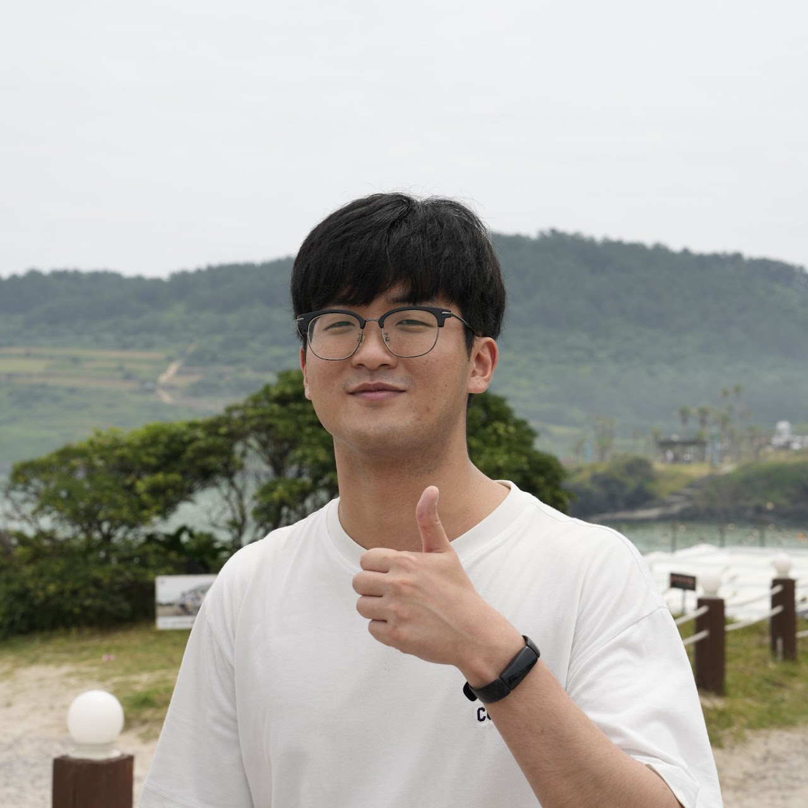

## About Me

Hi! I am a Ph.D. student in [HIS Lab](https://his-lab.org) at [POSTECH](https://postech.ac.kr), advised by Prof. [Inseok Hwang](https://www.inseokhwang.com/). My research focuses on designing AI and interactive systems that support human communication.

## Regular publications

- [ArithMotion: Peer-Relative Motion Generation for Social VR via Arithmetic Metaphor](https://doi.org/10.1145/3756884.3766039)
   - **Jaewoong Jang**, Sungjae Cho, Yeseul Shin, Inseok Hwang
   - [ACM VRST 2025](https://vrst.acm.org/vrst2025/), Montreal, QC, Canada
   - [video](https://www.youtube.com/watch?v=x6w9DkZUo8U&feature=youtu.be) 

- [AI-to-Human Actuation: Boosting Unmodified AI's Robustness by Proactively Inducing Favorable Human Sensing Conditions](https://dl.acm.org/doi/abs/10.1145/3580812)
   - Sungjae Cho, Yoonsu Kim, **Jaewoong Jang**, Inseok Hwang
   - [PACM IMWUT](https://dl.acm.org/journal/imwut), volume 7, issue 3, pp. 105:1-32 (September 2023).
   - [video](https://www.youtube.com/watch?v=yUSUkovPLjg&feature=youtu.be)

## Adjunct Publications

- [Step into My Agent’s Shoes: Augmenting Processual Experiences via Interactive Narrative Game Generation]()
   - Hyojin Ju*, **Jaewoong Jang***, Inseok Hwang
   - [ACM UIST 2026](https://uist.acm.org/2026) (Demo), Detroit, MI, USA

- [Noisync: Noise-aware Schedule Coordination for Multi-Family Housing]()
   - Donghyeon Kang, **Jaewoong Jang**, Inseok Hwang
   - [WellComp 2026](https://wellcomp2026.github.io), Shanghai, China

- [Demonstrating AHA: Boosting Unmodified AI's Robustness by Proactively Inducing Favorable Human Sensing Conditions](https://dl.acm.org/doi/abs/10.1145/3594739.3610718)
    - Sungjae Cho, **Jaewoong Jang**, Yoonsu Kim, Inseok Hwang
    - [ACM UbiComp 2023](https://www.ubicomp.org/ubicomp-iswc-2023/), Cancun, Mexico.

## Grants
- a Ph.D. fellowship from NRF (National Research Foundation) of Korea (Sep 2024 - Aug 2026)
  - Title: Communication Augmentation System Based on User Inputs for Reducing the Gap of Non-verbal Communication in Mixed Reality

## Academic Services
- Reviewer
   - CHI '26
   - VRST '25
   - IMWUT '24

## Education
- **Ph.D. Student**, POSTECH, Computer Science and Engineering (Sep 2022 - Current)
- **B.S**., Postech, Computer Science and Enginnering (March 2016 - Aug 2022)

## Volunteering
- Student Volunteer for **UIST 2022**

## Experience
- Machine Learning Engineer at **DreamBit** (2020.09. ~ 2021.02.)
  - Developing a trademark similarity inference model
